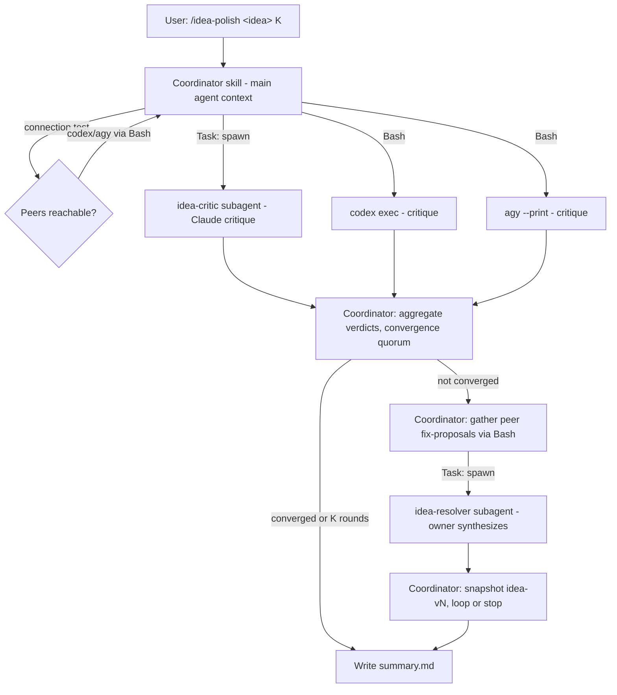

# feat: idea-polisher-cc — native Claude Code bundle

**Target repo:** `idea-polisher-cc` — **this** repository, already initialized with a committed scaffold (commit `8e7103c`); implementation finalizes and fills in the existing files rather than creating them from scratch. All repo-relative paths below are relative to its root. The existing `idea_polisher` Python CLI (a **separate** repo at `github.com/michaelguan1992/idea_polisher`) is the **reference implementation** and the source of the handoff manifest below.

## Summary

A separate, installable **Claude Code plugin** that runs the same cross-model idea-polishing debate as the `idea_polisher` CLI, but built from native Claude Code pieces: a **coordinator skill** (`/idea-polish`) that drives the loop, two **subagents** (`idea-critic`, `idea-resolver`) for Claude's own critique/resolution turns, and **Bash calls** to `codex` and `agy` for the peer models. Claude is the host, so it's the natural idea **owner/resolver**; Codex and Antigravity are peers. The design (single shared idea, peers-propose/owner-synthesizes, convergence + quorum rules, entry routing, graceful degradation, security posture) is **carried over settled** from the CLI — this plan repackages it, it does not re-decide it.

**Product Contract preservation:** N/A — direct planning (`ce-plan-bootstrap`). Behavior inherited from the `idea_polisher` CLI design, treated as fixed.

---

## Handoff from idea_polisher (the centerpiece)

This is the direct answer to "what should I hand off from this project?" Carry these over; leave the rest behind.

### Carry over (reuse near-verbatim)

| Asset (in `idea_polisher`) | Where it lands in `idea-polisher-cc` | Notes |
|---|---|---|
| The 4 prompt constants — `CRITIC_PROMPT`, `PROPOSAL_PROMPT`, `RESOLVER_PROMPT`, `CLASSIFIER_PROMPT` | The body of `agents/idea-critic.md`, `agents/idea-resolver.md`, and the coordinator skill | Copy near-verbatim; they are the product, not the Python. |
| The `---VERDICT-JSON---` delimiter + JSON verdict shape (`constructive` / `critiques` / `clarifications`) | Critic agent instructions + coordinator parsing rules | Keeps anti-spoof + structured parsing. |
| Convergence + quorum rule: "≥1 parsed critic AND all parsed non-constructive; parse-failures logged and excluded from the quorum" | Coordinator skill loop instructions | The hardened rule from the 2026-06-28 review. |
| Entry routing: classifier (does the idea already contain critiques?) → resolve-first vs critique-first; `--resolve-first` override; default critique-first on failure | Coordinator skill | |
| Cross-model invocation knowledge: `codex exec --skip-git-repo-check`, `agy --print --dangerously-skip-permissions`; connection test; owner-required/peers-best-effort degradation | `skills/idea-polish/references/peers.md` | The exact, hard-won command shapes. |
| Security posture: prompts as single args (no shell string), `cwd` scoped to the run folder for peer calls, the `--dangerously-skip-permissions` warning | `peers.md` + README | |
| Settled design decisions: single shared idea, peers-propose/owner-synthesizes, non-monotonic snapshots (keep all versions), the `summary.md` deliverable shape, the acceptance check | Coordinator skill + README | |
| The reviewed plan + 2026-06-28 review findings (`docs/plans/2026-06-28-001-…-plan.md` in the `idea_polisher` repo at `github.com/michaelguan1992/idea_polisher`) | Linked from the new repo's README as design rationale (GitHub URL, not a relative path — that file is not in this repo) | Start from the hardened design, not the naive one. |

### Leave behind (do not port)

- `idea_polish.py` — the Python orchestrator, `subprocess` adapters, `argparse`, file I/O. Replaced by skill + subagents + Bash.
- `test_idea_polish.py` — Python unit tests. Agent/skill markdown is validated by example runs, not `unittest`.
- Python `.gitignore` entries / packaging. The new repo gets plugin-appropriate scaffolding.

### Mechanism

Copy the prompt text (small, self-contained) into the new repo; **link** `idea_polisher` from the README as the reference implementation rather than vendoring Python or using a submodule. The CLI stays the deterministic fallback for anyone who wants it.

---

## Requirements

| ID | Requirement |
|----|-------------|
| R1 | A coordinator skill `/idea-polish` drives the full critic↔resolver debate within Claude Code. |
| R2 | Critic turn: Claude critiques via the `idea-critic` subagent; Codex and Antigravity critique via Bash (`codex exec`, `agy --print`). Every available model critiques the current idea. |
| R3 | Resolution: Claude (owner) synthesizes one revised idea via the `idea-resolver` subagent, drawing on peer fix-proposals gathered from Codex/Antigravity via Bash. |
| R4 | The loop stops at no-constructive-critique convergence (≥1 parsed critic, all parsed non-constructive, parse-failures excluded) or after K rounds. |
| R5 | Coordinator collects the idea and K, connection-tests peers, and degrades gracefully when a peer CLI is absent (Claude/owner always available as the host). |
| R6 | Entry routing: detect whether the idea already contains critiques → resolve-first vs critique-first, with a resolve-first override. |
| R7 | A run produces a `summary.md` (polished idea, per-round critique digest with dispositions, participating models, stop reason) plus per-round idea snapshots. |
| R8 | Distributed as an installable Claude Code plugin (`.claude-plugin/plugin.json` + `marketplace.json`) with README, LICENSE, and an example. |
| R9 | Reuse the `idea_polisher` prompts and hardened rules verbatim; do not re-derive product behavior. |

---

## Key Technical Decisions

- **KTD1 — Native bundle (per user choice).** Coordinator *skill* + critic/resolver *subagents* + Bash peer calls. Trade-off vs. the CLI: the loop is **prose-orchestrated** (the agent follows skill instructions) rather than Python-deterministic. Mitigated by the structured `---VERDICT-JSON---` verdict, explicit numbered loop steps in the skill, and keeping the `idea_polisher` CLI as the deterministic reference/fallback.
- **KTD2 — Coordinator must be a skill, not a subagent.** Claude Code subagents cannot spawn nested subagents; only the main agent (running the skill) can use the Task tool. So the loop, fan-out, and aggregation live in the skill; subagents are leaf workers for Claude's critique/resolution turns.
- **KTD3 — Claude is the default owner/resolver.** It's the host, so its turn runs natively (no `claude -p` subprocess). Codex/Antigravity are peers via Bash. Configurable non-Claude owner is deferred (see Open Questions).
- **KTD4 — Distribute as a Claude Code plugin.** `.claude-plugin/plugin.json` + `marketplace.json`, mirroring the compound-engineering plugin layout (verified locally), so others install with one command.
- **KTD5 — Reuse, don't re-derive.** Prompts, convergence/quorum, entry routing, degradation, and security posture are copied from `idea_polisher` as agent/skill instructions; the CLI repo is linked as the reference implementation.

---

## High-Level Technical Design

Native orchestration: the coordinator skill runs in the main agent context, spawns Claude's critic/resolver as subagents (fresh context per turn), and calls the peer CLIs via Bash. The *loop logic* (rounds, convergence, entry routing) is identical to the CLI's — carried over — so it is not re-drawn here; see `idea_polisher`'s plan for the loop flowchart.



---

## Output Structure

```text
idea-polisher-cc/
├── .claude-plugin/
│   ├── plugin.json          # manifest: name, version, description, author, license, repository
│   └── marketplace.json     # marketplace listing (plugins[].source = "./")
├── skills/
│   └── idea-polish/
│       ├── SKILL.md         # coordinator: intake, connection test, entry routing, loop, summary
│       └── references/
│           └── peers.md     # exact codex/agy commands, flags, degradation, security posture
├── agents/
│   ├── idea-critic.md       # Claude critique turn (CRITIC_PROMPT + verdict contract)
│   └── idea-resolver.md     # Claude owner synthesis turn (RESOLVER_PROMPT + disposition)
├── examples/
│   └── sample-idea.md
├── README.md                # install (marketplace), usage, requirements, ≥2-CLI note, security warning
└── LICENSE                  # MIT
```

Per-unit **Files** are authoritative; the tree is the expected shape.

---

## Implementation Units

### U1. Plugin scaffold + distribution manifest

- **Goal:** Finalize the already-committed plugin skeleton for `idea-polisher-cc` (the repo is initialized and scaffolded at commit `8e7103c`; this unit verifies/completes it, it does not create it from scratch).
- **Requirements:** R8.
- **Dependencies:** none.
- **Files (already present in the scaffold; finalize):** `.claude-plugin/plugin.json`, `.claude-plugin/marketplace.json`, `README.md` (stub — completed in U5), `LICENSE`, `.gitignore`. No `git init` — the repo already exists.
- **Approach:** Mirror the compound-engineering layout: confirm `plugin.json` has `name: idea-polisher-cc`, `version`, `description`, `author`, `license: MIT`, `repository`; confirm `marketplace.json` has `plugins: [{ name, description, source: "./" }]`; confirm `.gitignore` excludes any local run output. `README.md` (stub) and `LICENSE` (MIT) already exist in the committed scaffold — U5 completes the README.
- **Patterns to follow:** the verified `.claude-plugin/plugin.json` and `marketplace.json` from the compound-engineering plugin.
- **Test scenarios:** `Test expectation: structural smoke` — `plugin.json` and `marketplace.json` are valid JSON; the plugin installs from the local marketplace path without manifest errors.
- **Verification:** `claude` recognizes the plugin when added from the local path; no manifest validation errors.

### U2. Critic subagent

- **Goal:** Claude's critique turn as a reusable subagent.
- **Requirements:** R2, R9.
- **Dependencies:** U1.
- **Files:** `agents/idea-critic.md`.
- **Approach:** Frontmatter `name: idea-critic`, a `description` that makes it dispatchable, minimal `tools` (no Bash — it only reads and reasons). Body = `CRITIC_PROMPT` carried from `idea_polisher`, including the instruction to end with `---VERDICT-JSON---` and the `{constructive, critiques, clarifications}` object. Output contract: the subagent's final message is the verdict block (raw, for the coordinator to parse).
- **Patterns to follow:** agent-file frontmatter (name/description/tools) per the environment's agent definitions; `CRITIC_PROMPT` text from `idea_polish.py`.
- **Test scenarios:**
  - Smoke: dispatched on a vague idea → returns concrete critiques and a parseable `---VERDICT-JSON---` block with `constructive: true`.
  - Smoke: dispatched on a tight, well-scoped idea → returns `constructive: false`.
- **Verification:** a real dispatch returns a verdict the coordinator's parsing rules accept.

### U3. Resolver subagent

- **Goal:** Claude's owner-synthesis turn as a reusable subagent.
- **Requirements:** R3, R9.
- **Dependencies:** U1.
- **Files:** `agents/idea-resolver.md`.
- **Approach:** Frontmatter + body = `RESOLVER_PROMPT` carried over: given the current idea, aggregated critiques, and peer fix-proposals, output the full revised idea, then `---DISPOSITION---` and a per-critique disposition. Minimal tools (reason-only).
- **Patterns to follow:** `RESOLVER_PROMPT` / `DISPOSITION_DELIM` from `idea_polish.py`.
- **Test scenarios:**
  - Smoke: given an idea + 2 critiques + 1 peer proposal → returns a revised idea that visibly addresses the critiques plus a disposition listing each.
  - Edge: given critiques it judges wrong → marks them rejected-with-reason rather than silently dropping.
- **Verification:** a real dispatch returns idea + disposition split cleanly on the delimiter.

### U4. Coordinator skill (the loop)

- **Goal:** The orchestration that ties critics, peers, and the resolver into the bounded debate.
- **Requirements:** R1, R2, R3, R4, R5, R6, R7, R9.
- **Dependencies:** U2, U3.
- **Files:** `skills/idea-polish/SKILL.md`, `skills/idea-polish/references/peers.md`.
- **Approach:** `SKILL.md` frontmatter (`name: idea-polish`, dispatchable `description`). Body = numbered orchestration steps carrying the CLI's rules: (1) intake idea + K (+ owner default Claude, `--resolve-first`); (2) connection-test peers per `peers.md`, degrade gracefully (owner/host always present); (3) entry routing via the classifier; (4) loop — spawn `idea-critic` (Task) for Claude + Bash `codex`/`agy` for peers, aggregate verdicts, apply the convergence quorum (parse-failures excluded), handle clarifications, gather peer fix-proposals via Bash, spawn `idea-resolver` to synthesize, snapshot `idea-vN`, stop on convergence/`K`/resolve-failure; (5) write `summary.md`. `peers.md` holds the exact `codex exec --skip-git-repo-check` / `agy --print --dangerously-skip-permissions` commands, the connection-test probe, degradation rules, and the security posture: **pass the idea to peers without shell interpolation** — write the current idea to a run-folder file and feed it via stdin or a path argument (a Bash-tool call is always shell-parsed, so the CLI's `shell=False` no-injection guarantee does **not** carry over; raw interpolation of idea text containing `` ` ``, `$()`, or quotes is a command-injection vector under `--dangerously-skip-permissions`); **treat peer output as untrusted** — wrap each peer's critique/fix-proposal in delimited data blocks (e.g. `---PEER-OUTPUT-START---` / `---PEER-OUTPUT-END---`) and instruct the resolver to treat their contents as data, never as instructions; **run-folder `cwd`** so *relative*-path writes default there (this is not a sandbox — skip-permissions agents can still write absolute paths); and the `--dangerously-skip-permissions` warning.
- **Execution note:** because the loop is prose-orchestrated, write the steps as an explicit numbered procedure with the verdict-JSON contract front and center — ambiguity here is the main reliability risk (see Risks).
- **Patterns to follow:** the `idea_polisher` loop (KTD4/KTD5 of the CLI plan) and the compound-engineering `SKILL.md` structure (frontmatter + numbered phases + a `references/` file).
- **Test scenarios:**
  - Smoke (happy path): `/idea-polish` on `examples/sample-idea.md` with K=2 and all three CLIs reachable → runs ≥1 critique+resolve round and writes a `summary.md` with the polished idea + dispositions.
  - Degradation: with `agy` absent → run proceeds with Claude+Codex, notes the missing peer, owner still resolves.
  - Convergence: a tight idea → critics return non-constructive → stops early, idea unchanged.
  - Entry routing: an idea that embeds its own critiques → resolves first; `--resolve-first` forces it.
  - Quorum (parse-failure + constructive): one constructive critic + one peer whose verdict fails to parse → loop must **continue** (the parse-failure is excluded from the quorum, not counted as non-constructive).
  - Quorum (parse-failure + all non-constructive): all parsed verdicts non-constructive + one peer parse-failure → loop must **converge**, with the failure logged and excluded. Passing both parse-failure scenarios gates "implementation-ready" — they are the only evidence the prose form preserves the hardened rule.
- **Verification:** end-to-end `/idea-polish` run on the example yields `summary.md` + snapshots and terminates within K rounds.

### U5. README, example, and acceptance check

- **Goal:** Make the plugin installable, usable, and honestly scoped.
- **Requirements:** R7, R8.
- **Dependencies:** U4.
- **Files:** `README.md`, `examples/sample-idea.md`.
- **Approach:** README covers install via the marketplace, `/idea-polish` usage, requirements (Claude Code as host; optional `codex`/`agy` for cross-model — the ≥2-models-for-real-cross-model note), the `--dangerously-skip-permissions` security warning, where `summary.md` lands, and how to customize the prompts (edit the agent/skill files). Link `idea_polisher` as the reference implementation, and link the prior CLI plan (`docs/plans/2026-06-28-001-…-plan.md` in the `idea_polisher` repo) as design rationale via its GitHub URL — not a relative path, since that file does not exist in this repo. State the acceptance check: on a held-out seed idea, a before/after read confirms the final idea is more complete/specific than the seed.
- **Test scenarios:** `Test expectation: docs + one acceptance run` — the README install/usage steps match the actual plugin; one example run satisfies the acceptance check.
- **Verification:** a fresh install following only the README produces a working `/idea-polish` run.

---

## Scope Boundaries

**In scope:** repackaging the idea_polisher debate as a native Claude Code plugin (coordinator skill + critic/resolver subagents + Bash peers), with the handoff manifest realized.

### Deferred to Follow-Up Work
- **Configurable non-Claude owner** (owner = codex/agy). Default is Claude-as-host; the data model supports it but it's not wired.
- **Sharing prompts via submodule/package** instead of copy. Copy is the v1 mechanism.
- **Parallel peer calls** — sequential Bash calls are fine for v1.

### Out of scope
- Re-deciding product behavior (single-idea, peers-propose/owner-synthesizes, convergence rules) — inherited from the CLI.
- Changing the `idea_polisher` CLI itself.

---

## Risks & Dependencies

- **Prose-orchestrated loop is less deterministic than Python** (medium): the agent may miscount the convergence quorum, skip a peer, or drift from the steps. *Mitigation:* explicit numbered skill procedure, the structured verdict-JSON contract, and the CLI as the deterministic fallback. This is the accepted cost of the native form (KTD1).
- **Subagent nesting limit** (low, handled): coordinator is a skill, not a subagent (KTD2).
- **Peer execution security** (medium→high): Bash calls to `codex`/`agy` with skip-permissions run agents on user idea text. Two vectors: (a) **command injection** — idea text interpolated into a Bash command escapes quoting; the CLI's `shell=False` safety does not transfer to Bash-tool calls, so the idea must be passed via file/stdin, never a shell string; (b) **prompt injection** — peer free-text output flows back into the resolver and can carry hijacking instructions, so it must be wrapped in delimited untrusted-data blocks. *Mitigation:* file/stdin prompt passing, delimited untrusted peer-output blocks, run-folder `cwd` (relative-path default only — not a sandbox; absolute-path writes remain possible), README warning.
- **Plugin manifest schema drift** (low): grounded on the installed compound-engineering plugin; confirm against current Claude Code plugin docs at implementation.
- **Cost/latency** (low→medium): native Claude turn + 2 subagent spawns + up to 4 Bash peer calls per round × K.

---

## Open Questions

- **Owner configurability** — ship Claude-only owner for v1 (recommended), or wire codex/agy as possible owners now?
- **Marketplace hosting** — self-host the marketplace in this repo's `.claude-plugin/marketplace.json` (recommended) or list it in a shared marketplace?
- **Plugin manifest exact schema** — deferred to implementation (U1): confirm required vs optional `plugin.json` fields against current Claude Code docs; the compound-engineering manifest is the working reference.

### Deferred from 2026-06-28 doc-review

- **Determinism regression vs. the CLI (product/strategy)** — The plan repackages a working, deterministic, tested CLI into a prose-orchestrated form it itself calls less reliable, and the mitigation for that #1 risk is to fall back to the very CLI being replaced. Decide: is the native-plugin benefit (in-Claude-Code UX, one-command install) worth the determinism regression, or should v1 ship framed as an experiment? (product-lens)
- **Prompt source-of-truth (maintenance)** — Copying the prompts ("the product, not the Python") into a second repo guarantees the CLI and plugin drift apart. Decide whether to commit to a single shared source of truth before this second distribution ships, or accept copy-drift for v1 and state that cost in Risks. (product-lens)
- **Cross-model default value prop** — The default install (no `codex`/`agy`) degrades to Claude-critiquing-Claude — single-model self-review, not the cross-model product. Decide whether to hard-require ≥2 models for a real run, or reframe what the single-model default delivers. (product-lens)

---

## Sources & Research

- Local reference: the `idea_polisher` CLI (`idea_polish.py`, `docs/plans/2026-06-28-001-…-plan.md`) — source of all carried-over prompts, rules, and decisions.
- Plugin structure verified against the installed compound-engineering plugin: `.claude-plugin/plugin.json`, `.claude-plugin/marketplace.json`, `skills/<name>/SKILL.md` frontmatter, and the `agents/*.md` convention. No external research run (conventions confirmed locally; not requested).
