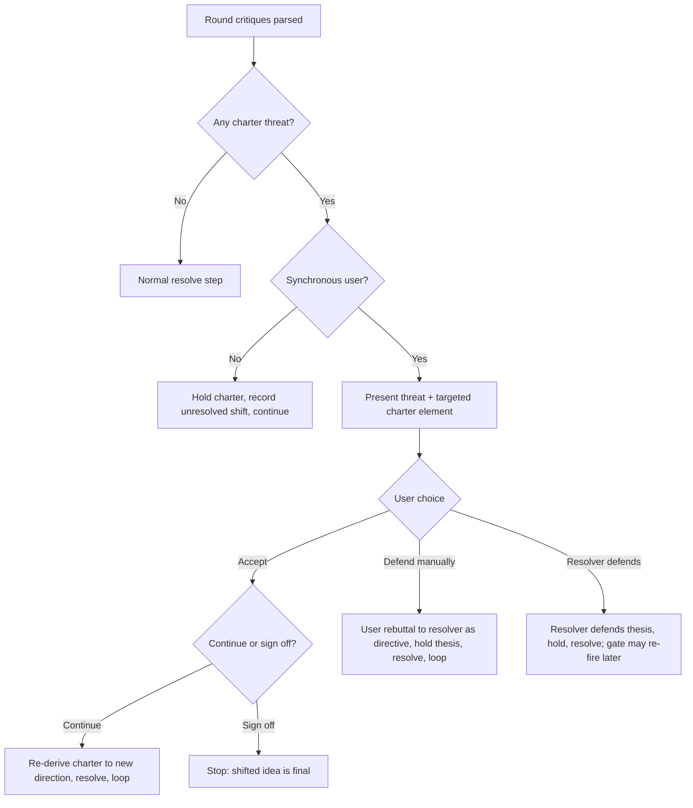

# Charter Gate for Idea Polish - Plan

## Goal Capsule

- **Objective:** Keep the idea-polish loop's critiques and resolutions anchored to the seed's original *problem* and *core thesis*. When the debate wants to shift either, pause and hand the user the wheel — accept, defend manually, or have the resolver defend — instead of drifting to a different idea silently.
- **Product authority:** Resolved in this session's `ce-brainstorm` dialogue. No separate requirements doc; the decisions are captured below.
- **Open blockers:** None. One tuning default (non-interactive behavior) is recorded as a Key Decision, not a blocker.

---

## Product Contract

### Summary

Add a **charter** — the seed's problem + core thesis/moat — captured and frozen at intake, then fed to every critic and resolver turn (Claude subagents *and* peer CLIs). The critic flags any critique that would shift the problem or thesis; when a shift is detected the coordinator **pauses and lets the user steer**: accept the shift (then continue or sign off), defend it themselves, or delegate the defense to the resolver. Nothing pivots off the seed without the user choosing it.

### Problem Frame

The loop today has no memory of the seed after round 0. The critic (`agents/idea-critic.md`) sees only the *current* idea each round and is told to set `constructive:false` "ONLY when you have no substantive critique" — so it always finds more to cut. The resolver (`agents/idea-resolver.md`) is told to make "this idea" (the current one) stronger by addressing critiques. Neither ever sees the original seed again, so there is no restoring force toward it.

The observed failure: a seed about an "agent experience-reuse platform" (cross-customer ML flywheel as the moat) converged over 9 rounds into "automated npm upgrade-PR gating" whose plan *explicitly abandons* the flywheel. The pivot happened silently in rounds 1→2, driven by the critics' strongest attacks landing on the seed's core mechanism and by narrowing being the cheapest way to satisfy any "too broad / unfalsifiable" critique. The convergence signal only asks "is the document coherent?", never "does this still answer the user's question?"

This is not about *preventing* drift — abandoning a weak thesis was the run's most valuable move. It is about making that pivot the user's **deliberate, surfaced choice** rather than a silent one.

### Requirements

**Charter capture**
- R1. At intake the coordinator distills the seed into a **charter**: the *problem* (the pain/need) and the *core thesis* (the central bet on how it wins and why it is defensible). Scope/breadth is deliberately **not** part of the charter.
- R2. The charter is confirmed with the user before the loop starts, and frozen to `runs/<ts>/charter.md`.
- R3. The charter text is injected into every critic turn, every resolver turn, and every peer critique/proposal call for the whole run.

**Shift detection**
- R4. Each critic (Claude subagent and peers) classifies its critiques: a critique that would require shifting the charter's problem or thesis is reported as a **charter threat**, distinct from a normal improvement critique.
- R5. The coordinator detects charter threats from the parsed verdicts each round. Any non-empty threat set fires the charter gate before the resolve step.

**The gate (user steers)**
- R6. On a detected shift the loop pauses and presents the user the threatening critique(s) and which charter element (problem or thesis) they target, with three choices: **Accept**, **Defend manually**, **Resolver defends**.
- R7. **Accept** offers a sub-choice: *continue* polishing the shifted idea, or *sign off* (stop; the shifted direction becomes the final idea). On accept-and-continue, the charter is re-derived to the accepted direction so the gate does not re-fire on the same, now-endorsed shift.
- R8. **Defend manually**: the user supplies a rebuttal, which is passed to the resolver as an authoritative defense directive; the thesis is held.
- R9. **Resolver defends**: the resolver writes a defense of the thesis against the threat; the thesis is held. If a later round re-raises the same shift, the gate fires again.

**Non-interactive safety**
- R10. When no synchronous user is available, the gate must **hold the charter** (never silent-accept, never silent-pivot), record the unresolved shift, and continue. The recorded shift surfaces in the run output for the user to decide later.

**Record**
- R11. `summary.md` records the charter, each shift event, and how it was steered (accepted / defended-manual / defended-resolver / held). `final-idea.md` stays the deliverable only — no charter or shift bookkeeping in it.

### Key Decisions

- **Anchor = problem + thesis; scope stays free.** Narrowing a platform to one workflow is legitimate convergence and must not trip the gate. Only a move off the *problem* or the *core bet* does. (Rejected: also anchoring scope — it would force polishing a bet the critics may have correctly judged weak.)
- **The user judges every detected shift, not a panel deadlock.** The critic/peer panel is the *detector*; the user is the *judge* on every detection. This was chosen over "resolver self-judges" (self-grading) and "panel adjudicates over N rounds" (delays user control). Accepted cost: the gate can fire as early as round 1 and again whenever a shift recurs.
- **Accept-and-continue re-derives the charter.** Without this the gate would re-fire forever on a shift the user already endorsed. Accepting a shift makes the new direction the anchor.
- **Non-interactive default is hold-and-record.** Headless runs (the common case for this tool) cannot steer; the fidelity-preserving default is to keep the charter and surface the fork afterward, never to decide it autonomously.
- **Verdict contract is extended, not replaced.** Charter threats ride alongside the existing `critiques`/`clarifications` so a peer that emits the old shape still parses (its threats are simply empty). Detection degrades safely to "no threat" rather than failing the round.

### Key Flow — the charter gate

**F1. Trigger:** one or more parsed verdicts in a round carry a non-empty charter-threat set.

**Covers R6, R7, R8, R9, R10.**

---

## Planning Contract

**Product Contract preservation:** N/A — no upstream Product Contract; decisions captured in this plan from the in-session brainstorm.

**Execution posture:** This skill is prose-orchestrated markdown (no code test harness in the repo). "Verification" is behavioral: replay a held-out seed and read the run output. The `agent_exp_reuse` run at `~/Downloads/agent_exp_reuse/` is the canonical regression fixture — its v1→v2 silent thesis pivot is exactly what the gate must now intercept.

---

## Implementation Units

### U1. Charter capture and freeze

- **Goal:** Add the intake step that distills the seed into a confirmed, frozen charter.
- **Requirements:** R1, R2.
- **Dependencies:** none.
- **Files:** `skills/idea-polish/SKILL.md`.
- **Approach:** Add a charter step to §1 Intake (after the run folder is created, before the loop). Coordinator drafts `{problem, thesis}` from the seed in plain language, confirms with the user via the platform blocking question tool (one chance to correct — the charter is load-bearing), and writes `runs/<ts>/charter.md`. Keep it short: a problem sentence and a thesis sentence naming the mechanism + why-defensible. Note in §3 entry routing that charter capture runs regardless of critique-first vs resolve-first.
- **Patterns to follow:** the existing §1 intake bullets and run-folder/`idea-v0.md` snapshot convention; user-confirmation style mirrors §4c clarifications.
- **Test scenarios:**
  - Replay the `agent_exp_reuse` seed: charter problem ≈ "agent task reliability/reuse", thesis ≈ "cross-customer ML effectiveness-discriminator flywheel as the moat". Confirm the thesis names the *mechanism*, not just the topic.
  - Seed with no clear thesis (a brain-dump): coordinator asks the user to state the thesis rather than inventing one.
- **Verification:** `runs/<ts>/charter.md` exists, is confirmed, and holds a problem + a mechanism-level thesis.

### U2. Thread charter into critics + add charter-threat to the verdict contract

- **Goal:** Every critic sees the charter and flags shifts; the verdict carries threats backward-compatibly.
- **Requirements:** R3, R4.
- **Dependencies:** U1.
- **Files:** `agents/idea-critic.md`, `skills/idea-polish/references/peers.md` (§ Critic prompt), `skills/idea-polish/SKILL.md` (§ Definitions verdict shape, §4a).
- **Approach:** Extend the verdict JSON with `"charter_threats": [str]` — critiques the critic believes would require shifting the charter's problem or thesis (each also stays in `critiques` if it is otherwise a valid critique, or moves to threats only; specify one rule: a charter-threatening point goes in `charter_threats` and *not* duplicated in `critiques`). Update `agents/idea-critic.md` and the peers.md critic prompt to pass the charter (fenced) and instruct the classification. Update the §Definitions verdict shape and §4a parsing to read the new field; a verdict lacking it parses with `charter_threats: []`.
- **Patterns to follow:** existing `---VERDICT-JSON---` contract and the untrusted-data fencing already used for peer I/O.
- **Test scenarios:**
  - A critique attacking the flywheel's viability lands in `charter_threats`, not `critiques`.
  - A critique about wording/missing-metric lands in `critiques`, `charter_threats` empty.
  - Old-shape verdict (no `charter_threats` key) parses as empty threats — no crash, round proceeds.
  - `Covers R4.` Peer verdict and Claude verdict both classify the same flywheel attack as a threat.
- **Verification:** `critiques-<n>.json` records `charter_threats` per model; absence degrades to empty.

### U3. Charter gate in the coordinator loop

- **Goal:** Detect threats and run the 3-way user steer (with non-interactive default) before resolve.
- **Requirements:** R5, R6, R7, R8, R9, R10.
- **Dependencies:** U2.
- **Files:** `skills/idea-polish/SKILL.md` (new §4b' gate between convergence check and resolve).
- **Approach:** After parsing verdicts, union the `charter_threats`. If non-empty and interactive: present the threats + targeted element, ask Accept / Defend-manually / Resolver-defends via the blocking tool. Accept → sub-ask Continue / Sign-off; Continue re-derives charter (hand to U5) and proceeds to resolve, Sign-off stops the loop with new reason `charter_signoff`. Defend-manually → capture the user rebuttal, carry it into the resolve step (U4) as a defense directive. Resolver-defends → carry a defense directive into resolve. If non-interactive: hold (treat threats as defended-by-hold), record the unresolved shift, continue to a normal resolve. Add `charter_signoff` to the §5 stop reasons and the finalize path.
- **Technical design (directional):** the gate produces a per-round `defense_directive` (one of `none` / `manual:<text>` / `resolver` / `hold`) that U4 consumes; Accept-continue produces no directive (the idea is allowed to shift) plus a charter re-derive.
- **Patterns to follow:** §4b convergence check structure; §4c interactive-vs-non-interactive handling (clarifications already branch on interactivity — mirror it).
- **Test scenarios:**
  - `Covers F1 / R6.` Threat detected, interactive → user is presented the gate with the 3 options and the targeted element named.
  - `Covers R7.` Accept→Sign-off stops with `charter_signoff`; Accept→Continue proceeds and does not re-fire the gate next round on the same shift.
  - `Covers R10.` Non-interactive run with a threat → loop holds the charter, records the shift, and continues (no pivot, no stall).
  - Replay `agent_exp_reuse` interactively: the v1→v2 flywheel-abandonment fires the gate instead of resolving silently.
- **Verification:** a threatening round cannot reach the resolve step (interactive) without a recorded user choice; non-interactive records the held shift.

### U4. Resolver defense mode + charter injection

- **Goal:** The resolver sees the charter, and on a defense directive defends the thesis instead of conceding.
- **Requirements:** R3, R8, R9.
- **Dependencies:** U3.
- **Files:** `agents/idea-resolver.md`, `skills/idea-polish/references/peers.md` (§ Proposal prompt), `skills/idea-polish/SKILL.md` (§4d).
- **Approach:** Pass the charter into the resolver turn and peer proposal calls. Add a `defense_directive` input: `manual:<text>` → fold the user's rebuttal in as the authoritative defense; `resolver` → write a principled defense of the thesis against the named threat; `hold` (non-interactive) → keep the thesis and note the unresolved threat in the disposition; `none` → current behavior. In all directive cases the revised idea must retain the charter's thesis; the disposition states how the threat was defended. Reinforce in `agents/idea-resolver.md` that the charter's problem/thesis are not abandoned silently — only via a directive routed by the gate.
- **Patterns to follow:** existing `---DISPOSITION---` contract and untrusted-peer-output fencing in `agents/idea-resolver.md`.
- **Test scenarios:**
  - `resolver` directive on the flywheel threat → revised idea keeps the flywheel thesis and the disposition contains a substantive defense, not a concession.
  - `manual` directive → the user's rebuttal appears as the defense; thesis retained.
  - `hold` → thesis retained, disposition flags the threat as unresolved/held.
  - `none` → unchanged from today's behavior on normal critiques.
- **Verification:** under any defense directive, `idea-v<n>.md` still carries the charter thesis; disposition names the defense.

### U5. Charter re-derive on accept + summary record

- **Goal:** Keep the anchor current after an accepted shift, and record charter + shift history in `summary.md` only.
- **Requirements:** R7, R11.
- **Dependencies:** U3.
- **Files:** `skills/idea-polish/SKILL.md` (§4b' accept path, §5b summary).
- **Approach:** On Accept-continue, re-derive `charter.md` to the accepted direction (overwrite with a dated note; version history is in the snapshots) so subsequent rounds anchor to it. In §5b add a `## Charter & shifts` block to `summary.md`: the (final) charter, plus each shift event with round, targeted element, and steer outcome — including held (non-interactive) shifts. `final-idea.md` is untouched by this unit; the finalizer keeps producing the deliverable as today, with no charter/shift bookkeeping added.
- **Patterns to follow:** §5b evolution-record structure.
- **Test scenarios:**
  - Accept-continue updates `charter.md`; the next round's critic sees the new charter and does not re-flag the endorsed shift.
  - `summary.md` lists each shift with its steer outcome, including a held (non-interactive) shift.
  - `final-idea.md` contains no charter or shift-record content.
- **Verification:** `summary.md` Charter & shifts block is present and complete for a run that hit the gate; `final-idea.md` carries none of it.

---

## Verification Contract

- No automated test harness exists (the skill is markdown prompts). Verification is a **behavioral replay** plus a **contract check**:
  - **Contract check:** hand-craft verdict JSON with and without `charter_threats`; confirm the coordinator's documented parsing reads both (new → threats, old → empty).
  - **Behavioral replay (primary):** re-run idea-polish on the `agent_exp_reuse` seed interactively and confirm the round-1→2 thesis abandonment fires the gate with the three choices; run it non-interactively and confirm hold-and-record.
- The existing SKILL.md "Acceptance check" (held-out seed before/after read) still applies and should now also confirm the final idea did not silently change its charter thesis.

## Definition of Done

- R1–R11 satisfied; each implementation unit's verification passes.
- Charter is captured, confirmed, frozen, and injected into Claude + peer critic/resolver/proposal turns.
- The gate fires on a detected shift in interactive runs and holds-and-records in non-interactive runs.
- `summary.md` records the charter and every shift event; `final-idea.md` stays deliverable-only.
- The `agent_exp_reuse` replay no longer pivots silently.

---

## Scope Boundaries

- **In scope:** anchoring problem + thesis; user-steered gate; charter injection into all critic/resolver/proposal turns; run-record updates.
- **Outside this feature's identity:** anchoring scope/breadth; blocking drift outright; auto-adjudicating shifts without the user; changing the convergence quorum mechanics.

### Deferred to Follow-Up Work

- Tuning whether recurring resolver-defended shifts should escalate differently after N repeats (today: gate re-fires each time — acceptable per the "user judges every detection" decision).
- A non-interactive "shift queue" report format richer than Open Concerns, if headless runs accumulate many held shifts.
- Updating `README.md` walkthrough/examples to show the gate (cosmetic; do alongside if convenient).

---

## Risks & Dependencies

- **Charter quality is load-bearing.** A mis-stated thesis anchors the gate on the wrong thing. Mitigation: the R2 user-confirmation step; keep the thesis at mechanism level (the U1 scenarios enforce this).
- **Over-firing noise.** Eager detection can pause early and often. This is an accepted, user-chosen trade; mitigation is crisp threat classification (U2) so normal critiques don't masquerade as threats.
- **Peer compliance.** A peer CLI may ignore the classification instruction and never populate `charter_threats`. Safe degradation: missing/empty threats = no gate from that peer; Claude's own critic still detects. Documented in U2.

## Open Questions

**Deferred to Planning/Implementation:**
- Exact wording of the charter-threat instruction that most reliably separates "shifts the bet" from "improves within the bet" across codex/agy — settle by iterating against the `agent_exp_reuse` fixture during U2.

## Sources & Research

- Skill under change: `skills/idea-polish/SKILL.md`, `agents/idea-critic.md`, `agents/idea-resolver.md`, `agents/idea-finalizer.md`, `skills/idea-polish/references/peers.md`.
- Regression fixture / motivating failure: `~/Downloads/agent_exp_reuse/` — seed `Agent经验复用平台 商业计划.md`, run `runs/20260628-143510/` (idea-v0→v9, `summary.md`); the v1→v2 step is the silent thesis pivot this feature intercepts.
